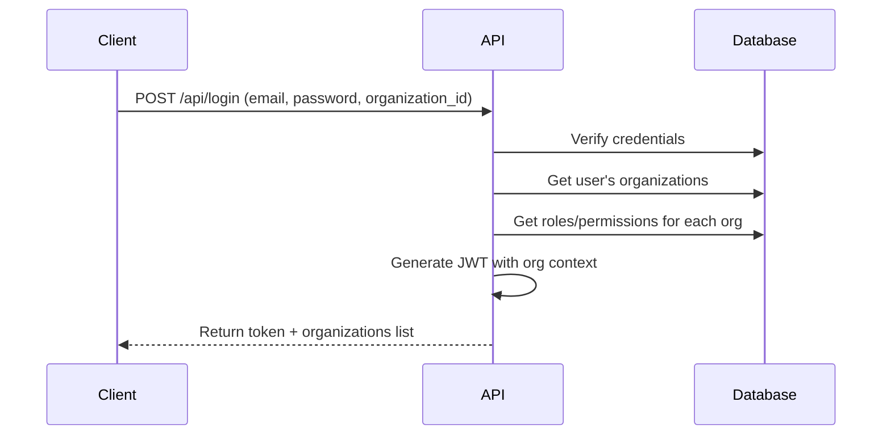
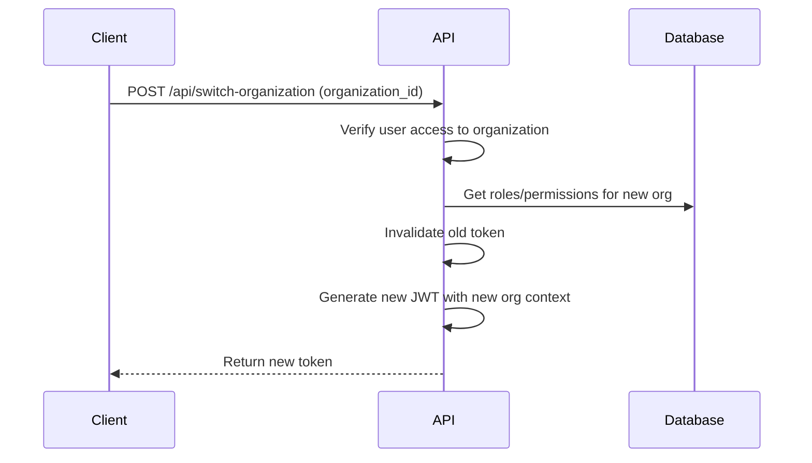
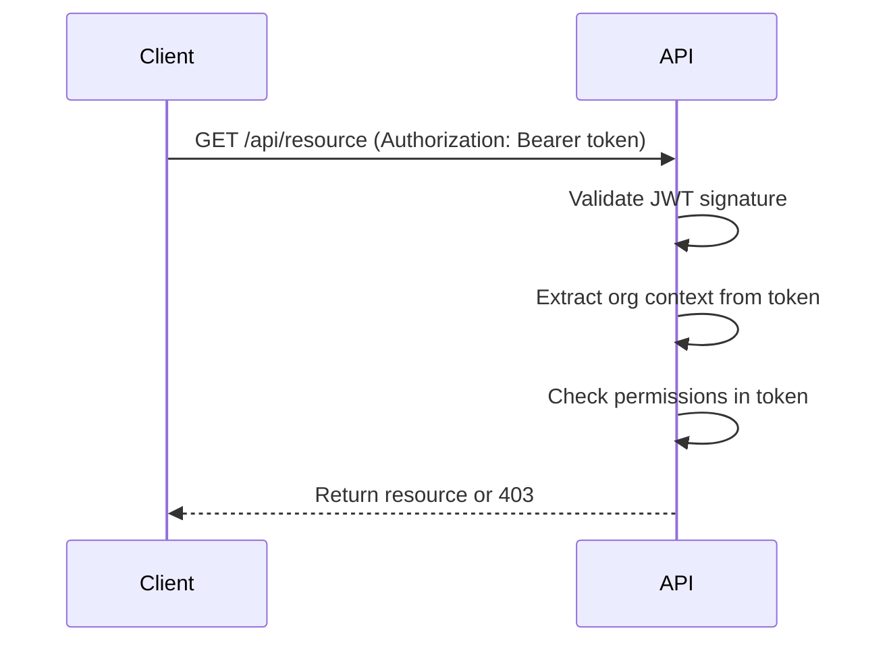

# Multi-Organization Authorization Microservice Documentation

## Overview

This is a **multi-organization authorization microservice** built with Laravel and JWT. It provides enterprise-grade authentication and authorization with support for multiple organizations, advanced security features, and flexible access control.

## Key Features

### Core Features
✅ **Multi-Tenancy** - Users can belong to multiple organizations/companies  
✅ **Organization-Scoped Roles** - Different roles per organization for the same user  
✅ **Organization-Scoped Permissions** - Permissions are isolated by organization  
✅ **Flexible Authorization** - Check permissions based on organization context  
✅ **JWT Authentication** - Secure token-based authentication  
✅ **Organization Context Middleware** - Automatic organization identification from headers/subdomain

### Security Features
✅ **Email Verification** - Required email confirmation with secure tokens  
✅ **Password Reset** - Secure password reset flow with email notifications  
✅ **Two-Factor Authentication (2FA)** - TOTP-based 2FA with QR codes and recovery codes  
✅ **Rate Limiting** - Protection against brute force attacks  
✅ **Account Lockout** - Automatic lockout after failed login attempts  
✅ **Secure Token Management** - JWT with refresh tokens

## Architecture

### Database Structure

**Core Tables:**
- `organizations` - Companies/organizations (uses UUID primary key for security)
- `users` - User accounts (shared across organizations)
- `roles` - Roles scoped to organizations
- `permissions` - Permissions scoped to organizations

**Relationship Tables:**
- `organization_user` - User membership in organizations
- `role_user` - User roles within specific organizations
- `permission_role` - Permissions assigned to roles
- `permission_user` - Direct user permissions

### Security: UUID-based Organization IDs

**Why UUIDs?**
- ✅ **Prevents enumeration attacks** - Can't guess organization IDs sequentially
- ✅ **Hides business metrics** - Number of organizations not exposed
- ✅ **Collision-free** - Safe for distributed systems and mergers
- ✅ **Publicly safe** - Can be exposed in URLs and APIs without risk

**Example Organization ID:** `019a77ec-851a-7028-8f56-5f31232cdf72`

Instead of predictable IDs like `1, 2, 3`, your organizations have cryptographically random UUIDs that cannot be guessed or enumerated.

### Multi-Organization Flow

```
User → Organization A → Role: Admin → Permissions: All
  ↓
  └→ Organization B → Role: User → Permissions: Limited
```

The same user can have:
- Admin role in Organization A
- User role in Organization B
- No access to Organization C

## Quick Start

### 1. Database Setup

```bash
php artisan migrate:fresh
php artisan db:seed --class=MultiOrganizationSeeder
```

### 2. Demo Data

**Organizations:**
- Acme Corporation (slug: `acme`, ID: UUID)
- TechStart Inc (slug: `techstart`, ID: UUID)

> **Note:** Organization IDs are UUIDs like `019a77ec-851a-7028-8f56-5f31232cdf72` for security

**Users:**
- `john@example.com` - Admin in Acme, User in TechStart
- `jane@example.com` - Moderator in both organizations
- `bob@example.com` - Admin in TechStart only
- Password: `password`

### 3. Start Server

```bash
php artisan serve
```

## API Usage

### Authentication

#### Login
```bash
curl -X POST http://localhost:8000/api/login \
  -H "Content-Type: application/json" \
  -d '{
    "email": "john@example.com",
    "password": "password"
  }'
```

**Response:**
```json
{
  "access_token": "...",
  "token_type": "Bearer",
  "user": {...},
  "organizations": [
    {"id": 1, "name": "Acme Corporation", "slug": "acme"},
    {"id": 2, "name": "TechStart Inc", "slug": "techstart"}
  ]
}
```

### Organization Context

There are **3 ways** to specify the organization context:

#### 1. Using Header (Recommended)
```bash
# You can use either the organization slug or UUID
curl -X GET http://localhost:8000/api/roles \
  -H "Authorization: Bearer TOKEN" \
  -H "X-Organization-ID: acme"

# Or with UUID
curl -X GET http://localhost:8000/api/roles \
  -H "Authorization: Bearer TOKEN" \
  -H "X-Organization-ID: 019a77ec-851a-7028-8f56-5f31232cdf72"
```

#### 2. Using Query Parameter
```bash
# Using slug
curl -X GET "http://localhost:8000/api/roles?organization_id=acme" \
  -H "Authorization: Bearer TOKEN"

# Or using UUID (more secure for public APIs)
curl -X GET "http://localhost:8000/api/roles?organization_id=019a77ec-851a-7028-8f56-5f31232cdf72" \
  -H "Authorization: Bearer TOKEN"
```

#### 3. Using Subdomain
```bash
curl -X GET http://acme.localhost:8000/api/roles \
  -H "Authorization: Bearer TOKEN"
```

> **Security Tip:** When exposing organization identifiers publicly (e.g., in URLs), use UUIDs instead of slugs for maximum security.

### Organization Management

#### List User's Organizations
```bash
GET /api/organizations
Authorization: Bearer {token}
```

#### Create New Organization
```bash
POST /api/organizations
Authorization: Bearer {token}

{
  "name": "New Company",
  "slug": "new-company",
  "domain": "newcompany.example.com",
  "description": "Description here"
}
```

#### Add User to Organization
```bash
POST /api/organizations/{id}/add-user
Authorization: Bearer {token}

{
  "user_id": 5
}
```

#### Get User's Context in Organization
```bash
GET /api/organizations/{id}/context
Authorization: Bearer {token}
```

**Response:**
```json
{
  "organization": {
    "id": "019a77ec-851a-7028-8f56-5f31232cdf72",
    "name": "Acme Corporation"
  },
  "roles": [
    {"id": 1, "name": "Administrator", "slug": "admin"}
  ],
  "permissions": [
    {"id": 1, "name": "View Users", "slug": "view-users"},
    ...
  ]
}
```

### Role Management (Organization-Scoped)

#### List Roles in Current Organization
```bash
GET /api/roles
Authorization: Bearer {token}
X-Organization-ID: acme
```

#### Create Role in Organization
```bash
POST /api/roles
Authorization: Bearer {token}
X-Organization-ID: acme

{
  "name": "Editor",
  "slug": "editor",
  "description": "Content editor role"
}
```

#### Assign Role to User in Organization
```bash
POST /api/roles/{id}/assign-user
Authorization: Bearer {token}
X-Organization-ID: acme

{
  "user_id": 5
}
```

### Permission Management (Organization-Scoped)

#### List Permissions in Current Organization
```bash
GET /api/permissions
Authorization: Bearer {token}
X-Organization-ID: acme
```

#### Create Permission in Organization
```bash
POST /api/permissions
Authorization: Bearer {token}
X-Organization-ID: acme

{
  "name": "Export Data",
  "slug": "export-data",
  "description": "Can export data"
}
```

## Programmatic Usage

### User Methods

```php
// Join a organization
$user->joinOrganization($organization);

// Leave a organization
$user->leaveOrganization($organization);

// Check membership
if ($user->belongsToOrganization($organization)) {
    // User is member of this organization
}

// Assign role in specific organization
$user->assignRoleInOrganization('admin', $organization);

// Remove role in specific organization
$user->removeRoleInOrganization('moderator', $organization);

// Check role in specific organization
if ($user->hasRoleInOrganization('admin', $organization)) {
    // User is admin in this organization
}

// Check permission in specific organization
if ($user->hasPermissionInOrganization('edit-posts', $organization)) {
    // User can edit posts in this organization
}

// Get all permissions in organization
$permissions = $user->getAllPermissionsInOrganization($organization);

// Get roles in organization
$roles = $user->rolesInOrganization($organization)->get();

// Get active organizations
$organizations = $user->getActiveOrganizations();
```

### Organization Methods

```php
// Add user to organization
$organization->addUser($user);

// Remove user from organization
$organization->removeUser($user);

// Check if user belongs to organization
if ($organization->hasUser($user)) {
    // User is a member
}
```

## Middleware Protection

### Require Organization Context

```php
Route::middleware(['auth:sanctum', 'organization'])->group(function () {
    // These routes require a organization context
});
```

### Require Role in Organization

```php
Route::middleware(['auth:sanctum', 'organization', 'role:admin'])->group(function () {
    // User must be admin in the current organization
});
```

### Require Permission in Organization

```php
Route::middleware(['auth:sanctum', 'organization', 'permission:edit-posts'])->group(function () {
    // User must have edit-posts permission in current organization
});
```

## Use Cases

### Example 1: SaaS Application

```
Company A (organization_id: 1)
├── John (Admin) - Full access
├── Jane (User) - Limited access
└── Bob (Moderator) - Content access

Company B (organization_id: 2)
├── John (User) - Limited access
└── Jane (Admin) - Full access
```

John has different permissions in Company A vs Company B.

### Example 2: Agency Platform

```
Client 1 (organization_id: 1)
└── Agency Staff → Role: Account Manager

Client 2 (organization_id: 2)
└── Same Staff → Role: Consultant
```

Agency staff have different roles for different clients.

### Example 3: Enterprise with Departments

```
HR Department (organization_id: 1)
├── Alice (HR Manager)
└── Bob (HR Assistant)

IT Department (organization_id: 2)
├── Alice (IT User)
└── Bob (IT Admin)
```

Same employees, different roles per department.

## Testing Examples

### Test 1: User in Multiple Organizations

```bash
# Login as John
TOKEN=$(curl -X POST http://localhost:8000/api/login \
  -H "Content-Type: application/json" \
  -d '{"email":"john@example.com","password":"password"}' \
  | jq -r '.access_token')

# Check roles in Acme (should be admin)
curl -X GET http://localhost:8000/api/organizations/1/context \
  -H "Authorization: Bearer $TOKEN"

# Check roles in TechStart (should be user)
curl -X GET http://localhost:8000/api/organizations/2/context \
  -H "Authorization: Bearer $TOKEN"
```

### Test 2: Organization-Scoped Permissions

```bash
# Try to access admin route in Acme (should work - John is admin)
curl -X GET http://localhost:8000/api/roles \
  -H "Authorization: Bearer $TOKEN" \
  -H "X-Organization-ID: acme"

# Try to access admin route in TechStart (should fail - John is user)
curl -X GET http://localhost:8000/api/roles \
  -H "Authorization: Bearer $TOKEN" \
  -H "X-Organization-ID: techstart"
```

### Test 3: Cross-Organization Isolation

```bash
# Bob should not access Acme data (he's only in TechStart)
curl -X GET http://localhost:8000/api/roles \
  -H "Authorization: Bearer BOB_TOKEN" \
  -H "X-Organization-ID: acme"
# Should return 403 Forbidden
```

## Best Practices

1. **Always Set Organization Context** - Use headers or subdomains to specify organization
2. **Scope All Queries** - Filter by organization_id when querying roles/permissions
3. **Validate Organization Access** - Check user belongs to organization before operations
4. **Use Middleware** - Apply organization middleware to all organization-scoped routes
5. **Audit Logs** - Track which organization context was used for each action

## Security Considerations

- ✅ **UUID Organization IDs** - Cryptographically random, prevents enumeration attacks
- ✅ **Organization Isolation** - Users can only access organizations they belong to
- ✅ **Scoped Authorization** - Roles and permissions are isolated per organization
- ✅ **No Data Leakage** - Cross-organization data access prevented by organization_id scoping
- ✅ **Access Validation** - Middleware validates organization membership before granting access
- ✅ **User-scoped Tokens** - API tokens are user-scoped, not organization-scoped
- ✅ **Safe Public Exposure** - UUIDs can be safely exposed in URLs and APIs

### Why UUIDs Matter for Security

**Without UUIDs (using auto-increment):**
```bash
# Attacker can easily enumerate all organizations
GET /api/organizations/1
GET /api/organizations/2
GET /api/organizations/3
# ... reveals total number of customers
```

**With UUIDs:**
```bash
# Attacker cannot guess or enumerate
GET /api/organizations/019a77ec-851a-7028-8f56-5f31232cdf72
# Next organization ID is unpredictable
GET /api/organizations/019a77ec-851b-7106-a6b9-a93e00b91358
```

## API Endpoints Summary

| Endpoint | Method | Description | Middleware |
|----------|--------|-------------|------------|
| `/api/login` | POST | User login | Public |
| `/api/organizations` | GET | List user's organizations | Auth |
| `/api/organizations` | POST | Create organization | Auth |
| `/api/organizations/{id}` | GET | Get organization details | Auth |
| `/api/organizations/{id}/context` | GET | Get user's roles/permissions in organization | Auth |
| `/api/organizations/{id}/add-user` | POST | Add user to organization | Auth |
| `/api/roles` | GET | List roles in organization | Auth + Organization + Admin |
| `/api/roles` | POST | Create role in organization | Auth + Organization + Admin |
| `/api/permissions` | GET | List permissions in organization | Auth + Organization + Admin |
| `/api/permissions` | POST | Create permission in organization | Auth + Organization + Admin |

## Troubleshooting

### "Organization context is required"
- Make sure to include `X-Organization-ID` header or `organization_id` parameter
- Or use subdomain routing

### "You do not have access to this organization"
- User is not a member of the specified organization
- Add user to organization first using `/api/organizations/{id}/add-user`

### "Unauthorized. Required role(s) in this organization"
- User doesn't have the required role in this specific organization
- Assign appropriate role using `/api/roles/{id}/assign-user`

## License

MIT License
# JWT Authentication with Multi-Organization Support

## Overview

The authentication system now uses **JWT (JSON Web Tokens)** with embedded roles and permissions for the current organization. Each JWT token contains:

- User identification
- Current organization (organization) context
- Roles in that organization
- Permissions in that organization

## Installation Complete

✅ JWT Auth package installed (`tymon/jwt-auth`)  
✅ JWT secret key generated  
✅ User model implements `JWTSubject`  
✅ Auth guard configured for JWT  
✅ AuthController updated with organization-aware login  

## API Endpoints

### 1. Login

**Endpoint:** `POST /api/login`

**Request:**
```json
{
  "email": "john@example.com",
  "password": "password",
  "organization_id": "acme"  // Optional: UUID or slug
}
```

**Response:**
```json
{
  "access_token": "eyJ0eXAiOiJKV1QiLCJhbGciOiJIUzI1NiJ9...",
  "token_type": "Bearer",
  "expires_in": 3600,
  "user": {
    "id": 1,
    "name": "John Doe",
    "email": "john@example.com"
  },
  "current_organization": {
    "id": "019a77f4-54f3-72c3-beec-c8b1a59dbc23",
    "name": "Acme Corporation",
    "slug": "acme",
    "domain": "acme.example.com",
    "roles": [
      {
        "id": 1,
        "name": "Administrator",
        "slug": "admin"
      }
    ],
    "permissions": [
      {
        "id": 1,
        "name": "View Users",
        "slug": "view-users"
      },
      {
        "id": 2,
        "name": "Create Users",
        "slug": "create-users"
      },
      ...
    ]
  },
  "organizations": [
    {
      "id": "019a77f4-54f3-72c3-beec-c8b1a59dbc23",
      "name": "Acme Corporation",
      "slug": "acme",
      "domain": "acme.example.com",
      "roles": [...],
      "permissions": [...]
    },
    {
      "id": "019a77f4-54f4-7382-8f5e-e680fb75bb18",
      "name": "TechStart Inc",
      "slug": "techstart",
      "domain": "techstart.example.com",
      "roles": [...],
      "permissions": [...]
    }
  ]
}
```

**Key Features:**
- ✅ Returns JWT token with organization context embedded
- ✅ Lists ALL organizations user belongs to
- ✅ Each organization includes user's roles and permissions
- ✅ Auto-selects first organization if `organization_id` not provided
- ✅ Token expires in 60 minutes (configurable in `config/jwt.php`)

### 2. Switch Organization

**Endpoint:** `POST /api/switch-organization`

**Headers:**
```
Authorization: Bearer {token}
Content-Type: application/json
```

**Request:**
```json
{
  "organization_id": "techstart"  // UUID or slug
}
```

**Response:**
```json
{
  "access_token": "eyJ0eXAiOiJKV1QiLCJhbGciOiJIUzI1NiJ9...",  // New token
  "token_type": "Bearer",
  "expires_in": 3600,
  "current_organization": {
    "id": "019a77f4-54f4-7382-8f5e-e680fb75bb18",
    "name": "TechStart Inc",
    "slug": "techstart",
    "domain": "techstart.example.com",
    "roles": [
      {
        "id": 7,
        "name": "User",
        "slug": "user"
      }
    ],
    "permissions": [
      {
        "id": 13,
        "name": "View Posts",
        "slug": "view-posts"
      },
      {
        "id": 14,
        "name": "Create Posts",
        "slug": "create-posts"
      }
    ]
  },
  "message": "Successfully switched to TechStart Inc"
}
```

**Key Features:**
- ✅ Invalidates old JWT token
- ✅ Generates new token with updated organization context
- ✅ Validates user has access to requested organization
- ✅ Returns new roles and permissions for the organization

### 3. Get Current User

**Endpoint:** `GET /api/user`

**Headers:**
```
Authorization: Bearer {token}
```

**Response:**
```json
{
  "id": 1,
  "name": "John Doe",
  "email": "john@example.com",
  "current_organization": {
    "id": "019a77f4-54f3-72c3-beec-c8b1a59dbc23",
    "name": "Acme Corporation",
    "slug": "acme",
    "roles": [
      {
        "id": 1,
        "name": "Administrator",
        "slug": "admin"
      }
    ],
    "permissions": [
      {
        "id": 1,
        "name": "View Users",
        "slug": "view-users"
      },
      ...
    ]
  }
}
```

**Key Features:**
- ✅ Extracts organization context from JWT token
- ✅ Returns current organization roles and permissions
- ✅ No database queries needed (data in token)

### 4. Logout

**Endpoint:** `POST /api/logout`

**Headers:**
```
Authorization: Bearer {token}
```

**Response:**
```json
{
  "message": "Successfully logged out"
}
```

**Key Features:**
- ✅ Invalidates JWT token (adds to blacklist)
- ✅ Token cannot be reused after logout

## JWT Token Payload

The JWT token contains the following claims:

```json
{
  "iss": "http://127.0.0.1:8000",  // Issuer
  "iat": 1699876543,                // Issued at
  "exp": 1699880143,                // Expires at
  "nbf": 1699876543,                // Not before
  "jti": "random-unique-id",        // JWT ID
  "sub": 1,                         // User ID
  "prv": "hash",                    // Provider hash
  "organization_id": "019a77f4-54f3-72c3-beec-c8b1a59dbc23",
  "roles": [
    {
      "id": 1,
      "name": "Administrator",
      "slug": "admin"
    }
  ],
  "permissions": [
    {
      "id": 1,
      "name": "View Users",
      "slug": "view-users"
    },
    ...
  ]
}
```

## Authentication Flow

### Login with Organization



### Switch Organization



### Access Protected Resource



## Example Usage

### cURL Examples

**1. Login to specific organization:**
```bash
curl -X POST http://127.0.0.1:8000/api/login \
  -H "Content-Type: application/json" \
  -d '{
    "email": "john@example.com",
    "password": "password",
    "organization_id": "acme"
  }'
```

**2. Login without specifying organization (uses first):**
```bash
curl -X POST http://127.0.0.1:8000/api/login \
  -H "Content-Type: application/json" \
  -d '{
    "email": "john@example.com",
    "password": "password"
  }'
```

**3. Switch to different organization:**
```bash
TOKEN="your-jwt-token-here"

curl -X POST http://127.0.0.1:8000/api/switch-organization \
  -H "Authorization: Bearer $TOKEN" \
  -H "Content-Type: application/json" \
  -d '{
    "organization_id": "techstart"
  }'
```

**4. Get current user info:**
```bash
curl -X GET http://127.0.0.1:8000/api/user \
  -H "Authorization: Bearer $TOKEN"
```

### JavaScript/Fetch Example

```javascript
// Login
const loginResponse = await fetch('http://127.0.0.1:8000/api/login', {
  method: 'POST',
  headers: {
    'Content-Type': 'application/json',
  },
  body: JSON.stringify({
    email: 'john@example.com',
    password: 'password',
    organization_id: 'acme'  // Optional
  })
});

const loginData = await loginResponse.json();
const token = loginData.access_token;
const organizations = loginData.organizations;

// Store token
localStorage.setItem('jwt_token', token);
localStorage.setItem('current_org', JSON.stringify(loginData.current_organization));
localStorage.setItem('organizations', JSON.stringify(organizations));

// Switch organization
const switchResponse = await fetch('http://127.0.0.1:8000/api/switch-organization', {
  method: 'POST',
  headers: {
    'Authorization': `Bearer ${token}`,
    'Content-Type': 'application/json',
  },
  body: JSON.stringify({
    organization_id: 'techstart'
  })
});

const switchData = await switchResponse.json();
const newToken = switchData.access_token;

// Update stored token
localStorage.setItem('jwt_token', newToken);
localStorage.setItem('current_org', JSON.stringify(switchData.current_organization));
```

## Frontend Implementation Tips

### 1. Store Organizations on Login

```javascript
// After login, store all organizations
const { organizations, current_organization, access_token } = loginResponse;

// Store in state management (Redux, Vuex, etc.)
store.dispatch('auth/setToken', access_token);
store.dispatch('auth/setOrganizations', organizations);
store.dispatch('auth/setCurrentOrganization', current_organization);
```

### 2. Organization Switcher Component

```javascript
// Render organization switcher dropdown
const OrganizationSwitcher = () => {
  const organizations = useSelector(state => state.auth.organizations);
  const currentOrg = useSelector(state => state.auth.currentOrganization);
  
  const handleSwitch = async (orgId) => {
    const response = await api.post('/switch-organization', {
      organization_id: orgId
    });
    
    // Update token and current org
    store.dispatch('auth/setToken', response.access_token);
    store.dispatch('auth/setCurrentOrganization', response.current_organization);
  };
  
  return (
    <Dropdown>
      <DropdownButton>{currentOrg.name}</DropdownButton>
      <DropdownMenu>
        {organizations.map(org => (
          <DropdownItem 
            key={org.id}
            onClick={() => handleSwitch(org.id)}
            active={org.id === currentOrg.id}
          >
            {org.name}
            <Badge>{org.roles.map(r => r.name).join(', ')}</Badge>
          </DropdownItem>
        ))}
      </DropdownMenu>
    </Dropdown>
  );
};
```

### 3. Check Permissions Client-Side

```javascript
// Extract permissions from current organization
const hasPermission = (permission) => {
  const currentOrg = store.getState().auth.currentOrganization;
  return currentOrg.permissions.some(p => p.slug === permission);
};

// Use in components
{hasPermission('create-users') && (
  <Button>Create User</Button>
)}
```

## Configuration

### JWT TTL (Time To Live)

Edit `config/jwt.php`:

```php
'ttl' => env('JWT_TTL', 60),  // Minutes
```

### JWT Refresh

```php
'refresh_ttl' => env('JWT_REFRESH_TTL', 20160),  // 2 weeks
```

### JWT Secret

The secret is stored in `.env`:
```
JWT_SECRET=your-secret-key-here
```

## Security Considerations

✅ **Token Expiration** - Tokens expire after 60 minutes (default)  
✅ **Token Blacklist** - Logged out tokens are blacklisted  
✅ **Organization Validation** - System verifies user access to organization  
✅ **Embedded Permissions** - No DB queries needed for permission checks  
✅ **HTTPS Required** - Use HTTPS in production to protect tokens  

## Migration from Sanctum

If you need to support both JWT and Sanctum:

```php
// In routes/api.php
Route::middleware(['auth:api,sanctum'])->group(function () {
    // Routes support both JWT and Sanctum tokens
});
```

## Troubleshooting

### "Token has expired"
- Token TTL is 60 minutes by default
- Implement token refresh mechanism
- Or prompt user to re-login

### "Token could not be parsed from the request"
- Ensure header format: `Authorization: Bearer {token}`
- Token must be sent with every request

### "This action is unauthorized"
- User doesn't have required permission in current organization
- Check organization context is correct
- Verify permissions are in JWT token payload

## Next Steps

1. ✅ **Implement token refresh** - Allow extending session without re-login
2. ✅ **Add permission middleware** - Check JWT permissions for routes
3. ✅ **Create organization picker UI** - Frontend component to switch orgs
4. ✅ **Add audit logging** - Track which org context was used for actions
